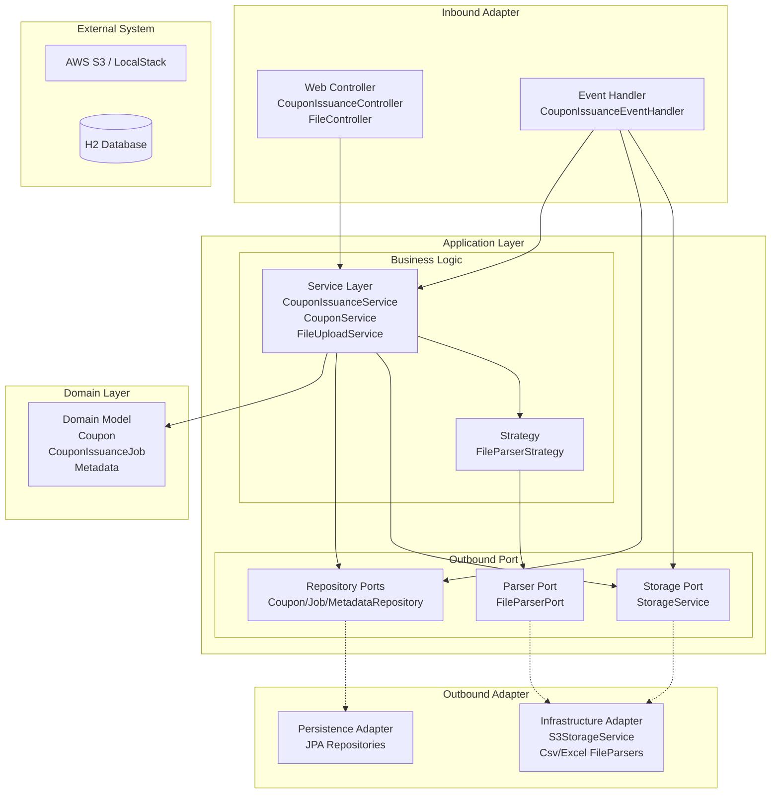
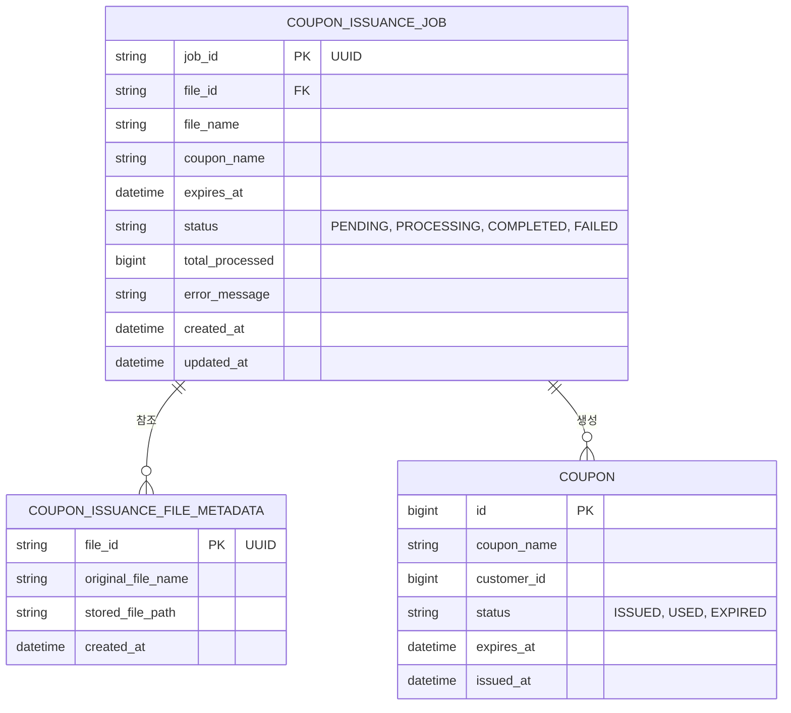

# 쿠폰 관리 시스템 Admin

## 프로젝트 개요

- 본 프로젝트는 CSV 및 Excel 사용자 목록을 활용한 대량 쿠폰 발급 기능을 제공하는 API 서버입니다.
- 스트리밍 방식의 파일 파싱과 이벤트 기반 비동기 처리를 통해 대용량 데이터 처리의 효율성을 높였습니다.

<br>

## 기술 스택

- Backend
  - Java 17
  - Spring Boot 3.5.7
- Database
  - Spring Data JPA
  - H2 Database (테스트용)
- Storage
  - AWS S3 (AWS SDK v2)
  - LocalStack (로컬 개발용 에뮬레이션)
- Build Tool
  - Gradle
- API Documentation
  - Swagger (SpringDoc)

<br>

## 시스템 아키텍처



### 모듈별 역할

- **Inbound Adapter**
  - 사용자의 HTTP 요청을 처리하는 컨트롤러와 비동기 이벤트를 수신하는 핸들러를 포함
- **Application Layer**
  - 비즈니스 유스케이스를 구현하며, 포트(Port) 인터페이스를 통해 아웃바운드 어댑터와 통신
- **Domain Layer**
  - 쿠폰, 작업 상태, 파일 메타데이터 등 핵심 도메인 모델과 비즈니스 규칙을 관리
- **Outbound Adapter**
  - 데이터베이스 영속성 처리 및 S3 파일 저장, 파일 파싱 등 외부 인프라와의 연동을 담당

<br>

## ERD (Entity Relationship Diagram)



<br>

## 주요 기능

- 쿠폰 대량 발급
  - CSV 및 Excel 파일을 통한 대규모 사용자 목록 처리
  - 메모리 사용량 최소화를 위한 스트리밍 방식의 파일 파싱
  - 비동기 처리(Event-Driven)를 통한 즉각적인 API 응답
- 파일 관리 및 저장
  - AWS S3를 이용한 파일 저장 및 관리
  - Presigned URL을 통한 클라이언트-S3 간 직접 업로드/다운로드 지원
- 작업 상태 추적
  - 비동기로 진행되는 쿠폰 발급 작업의 실시간 진행률 및 상태 조회
- 유효성 검증
  - 파일 형식 및 헤더 검증
  - 필수 입력 값 및 날짜 유효성 체크

<br>

## 실행 방법

1. LocalStack 실행 (S3 에뮬레이션용)

   ```bash
   docker run -d -p 4566:4566 localstack/localstack
   ```

2. 프로젝트 빌드 및 실행

   ```bash
   ./gradlew bootRun
   ```

3. 서버 실행 확인 및 Swagger UI 접속
   - http://localhost:8081/swagger-ui/index.html

<br>

## API 문서

### 파일 업로드

- **Endpoint**
  - `/api/files/upload`
- **Method**
  - `POST`
- **Description**
  - 사용자 목록 파일을 업로드하고 관리용 ID를 생성함 (쿠폰 발급은 수행하지 않음)
- **Request Body (form-data)**
  - `file` (MultipartFile)
- **Response Body**

  ```json
  {
    "fileId": "7abc0907-2df8-421d-b54a-f440c9bbb056"
  }
  ```

### 쿠폰 발급 요청 (파일 업로드 포함)

- **Endpoint**
  - `/api/coupon-issuances/upload`
- **Method**
  - `POST`
- **Description**
  - 파일을 업로드함과 동시에 비동기 쿠폰 발급 작업을 생성함
- **Request Body (form-data)**
  - `file` (MultipartFile)
  - `couponName` (String)
  - `expiresAt` (LocalDateTime, ISO 8601)
- **Example**

  ```bash
  curl -X POST "http://localhost:8081/api/coupon-issuances/upload" \
    -F "file=@customers.csv" \
    -F "couponName=신규 가입 쿠폰" \
    -F "expiresAt=2025-12-31T23:59:59"
  ```

- **Response Body**

  ```json
  {
    "jobId": "9232e60a-2e11-466e-be8d-e237918a551f"
  }
  ```

### 쿠폰 발급 작업 상태 조회

- **Endpoint**
  - `/api/coupon-issuances/jobs/{jobId}/status`
- **Method**
  - `GET`
- **Description**
  - 특정 발급 작업의 현재 진행 상태와 상세 정보를 조회함
- **Path Variable**
  - `jobId` (UUID)
- **Response Body**

  ```json
  {
    "jobId": "9232e60a-2e11-466e-be8d-e237918a551f",
    "fileId": "7abc0907-2df8-421d-b54a-f440c9bbb056",
    "fileName": "customers.csv",
    "couponName": "신규 가입 쿠폰",
    "status": "COMPLETED",
    "totalProcessed": 10000,
    "errorMessage": null,
    "createdAt": "2025-08-13T14:41:42",
    "updatedAt": "2025-08-13T14:45:30"
  }
  ```

### 파일 직접 다운로드

- **Endpoint**
  - `/api/coupon-issuances/{fileId}/download`
- **Method**
  - `GET`
- **Description**
  - 서버를 경유하여 업로드된 원본 파일을 스트리밍 방식으로 다운로드함

### S3 업로드용 Presigned URL 생성

- **Endpoint**
  - `/api/coupon-issuances/presigned-url/upload`
- **Method**
  - `POST`
- **Description**
  - 클라이언트가 S3에 직접 파일을 업로드할 수 있는 Presigned URL을 생성함
- **Request Body (form-data)**
  - `fileName` (String)
  - `expirationMinutes` (Integer, 기본 60)
- **Response Body**

  ```json
  {
    "presignedUrl": "https://s3.amazonaws.com/coupon-admin-dev/...",
    "fileKey": "7abc0907_customers.csv"
  }
  ```

### S3 업로드 완료 후 발급 처리

- **Endpoint**
  - `/api/coupon-issuances/s3-upload-complete`
- **Method**
  - `POST`
- **Description**
  - S3에 직접 업로드된 파일을 대상으로 비동기 쿠폰 발급을 요청함
- **Request Body (form-data)**
  - `fileKey` (String)
  - `originalFileName` (String)
  - `couponName` (String)
  - `expiresAt` (LocalDateTime)

### S3 다운로드용 Presigned URL 생성

- **Endpoint**
  - `/api/coupon-issuances/{fileId}/presigned-url/download`
- **Method**
  - `GET`
- **Description**
  - S3에서 직접 파일을 다운로드할 수 있는 Presigned URL을 생성함

<br>

## 상태 및 오류 코드

### 공통 에러 응답 형식

- **Success Response**
  ```json
  {
    "jobId": "generated_uuid_string"
  }
  ```
- **Error Response**
  ```json
  {
    "code": "C001",
    "message": "잘못된 입력 값입니다",
    "errors": {
      "couponName": "쿠폰명은 필수입니다",
      "expiresAt": "만료일은 미래여야 합니다"
    }
  }
  ```

### 주요 오류 코드 (Error Codes)

- **공통**
  - `C001` (INVALID_INPUT_VALUE)
    - **message**: `잘못된 입력 값입니다`
    - **description**: 요청 파라미터가 비어 있거나 유효성 검증에 실패한 경우
  - `C002` (FILE_NOT_FOUND)
    - **message**: `요청한 파일을 찾을 수 없습니다`
    - **description**: DB에 저장된 파일 메타데이터를 찾을 수 없는 경우
  - `C003` (UNSUPPORTED_FILE_TYPE)
    - **message**: `지원하지 않는 파일 형식입니다. CSV 또는 Excel 파일만 지원합니다`
  - `C004` (INTERNAL_SERVER_ERROR)
    - **message**: `내부 서버 오류가 발생했습니다`

- **파일 파싱**
  - `F001` (FILE_IS_EMPTY)
    - **message**: `파일이 비어있습니다`
  - `F002` (INVALID_FILE_HEADER)
    - **message**: `유효하지 않은 헤더입니다. 첫 번째 컬럼은 'customer_id'여야 합니다`
  - `F003` (EMPTY_CUSTOMER_LIST)
    - **message**: `고객 목록이 비어있습니다`
  - `F004` (FILE_PARSING_FAILED)
    - **message**: `파일 파싱에 실패했습니다`

- **스토리지 및 작업 상태**
  - `J001` (JOB_NOT_FOUND)
    - **message**: `요청한 작업을 찾을 수 없습니다`
  - `S002` (FILE_STORAGE_FAILED)
    - **message**: `파일 저장에 실패했습니다`
  - `S006` (INVALID_FILE_PARSER)
    - **message**: `파일 파서를 찾을 수 없습니다`

<br>

## 시스템 정책 및 제약 사항

- **파일 처리 정책**
  - **최대 업로드 크기**: 단일 파일 500MB, 전체 요청 500MB
  - **메모리 효율화**: 2MB 초과 파일은 디스크 스풀링(임시 파일 사용) 처리
  - **지원 형식**: CSV (.csv), Excel (.xlsx, .xls)
  - **유효성 검증**: 첫 번째 컬럼 헤더가 `customer_id`인지 확인, 빈 파일 및 빈 고객 목록 거부

- **비동기 및 배치 처리 정책**
  - **쿠폰 발급 배치 크기**: 1,000건 단위로 데이터베이스 저장 (애플리케이션 계층)
  - **JPA 배치 설정**: Hibernate JDBC batch size 100 적용
  - **이벤트 처리**: 메인 트랜잭션 커밋 후(`AFTER_COMMIT`) 별도 스레드에서 비동기 실행
  - **스레드 풀 설정**: 기본 5개, 최대 10개 스레드, 대기 큐 100개 (`coupon-issuance-` 접두어)

- **도메인 상태 관리**
  - **작업(Job) 상태**: `PENDING`(대기), `PROCESSING`(처리중), `COMPLETED`(완료), `FAILED`(실패)
  - **쿠폰(Coupon) 상태**: `ISSUED`(발급), `USED`(사용), `EXPIRED`(만료)
  - **만료 정책**: 쿠폰 만료일은 반드시 요청 시점보다 미래여야 함 (Future 검증)
