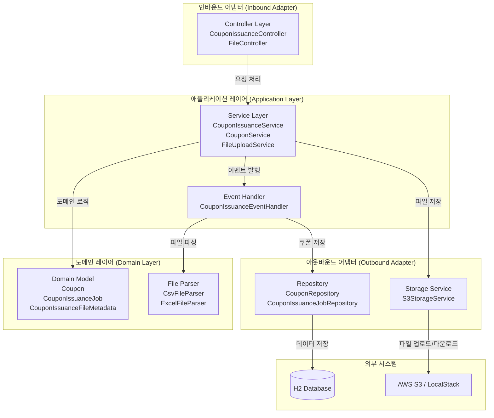
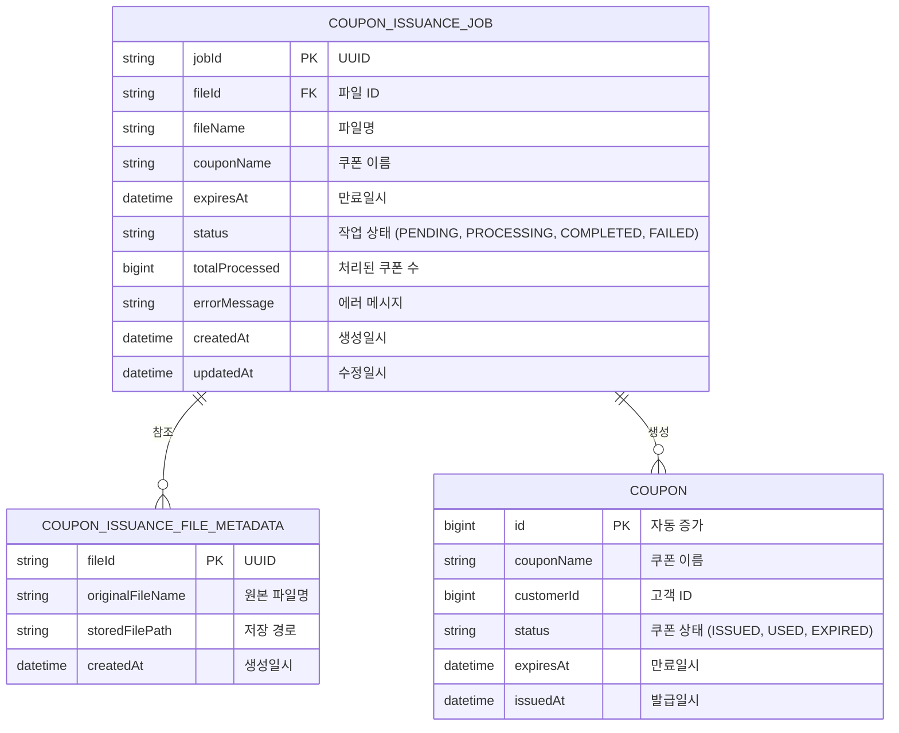
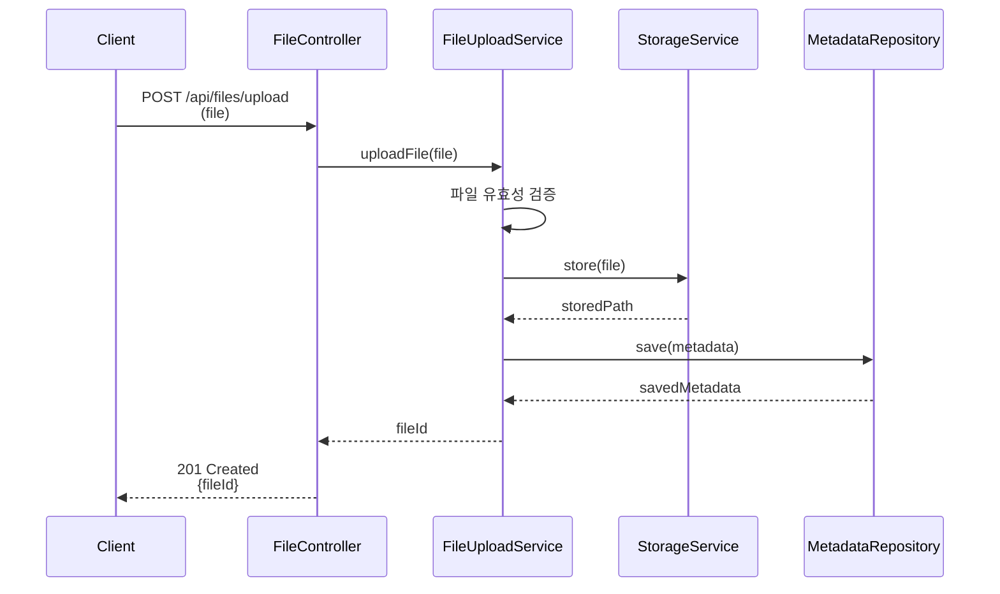
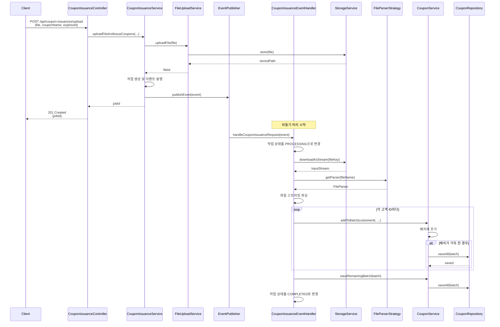
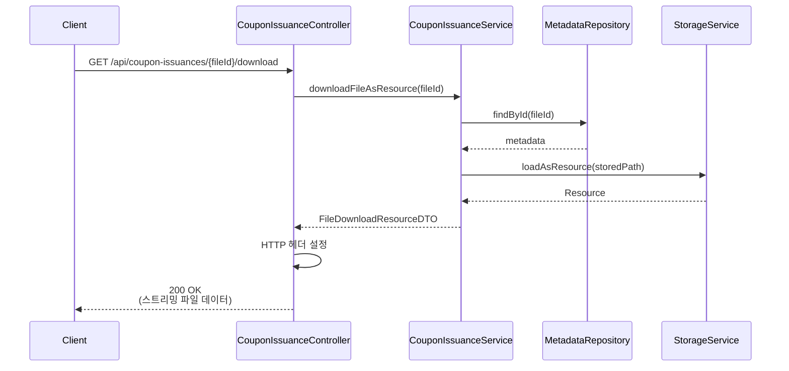
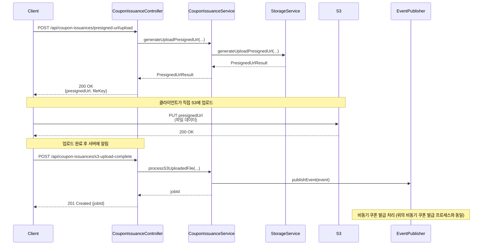

# 쿠폰 관리 시스템 Admin

## 프로젝트 개요

- 대량 쿠폰 발급을 위한 관리자 시스템
- CSV 또는 Excel 형식의 사용자 목록 파일 업로드로 쿠폰 대량 발급
- 업로드된 파일 다운로드 기능 제공

### 주요 특징

-  스트리밍 방식으로 파일 처리하여 메모리 사용량 최소화
- **비동기 처리** - Event-Driven 패턴으로 쿠폰 발급을 비동기 처리하여 API 응답 시간 단축
- **S3 스토리지** - AWS S3를 통한 파일 저장 (로컬 개발 환경에서는 LocalStack 사용)
- **구조화된 로깅** - JSON 형식의 구조화된 로깅으로 운영 모니터링 지원

</br>

## 기술 스택

### Backend
- Java 17
- Spring Boot 3.5.7
- Spring Data JPA

### Database
- H2 Database (개발/테스트 환경)

### Storage
- AWS S3
    - 로컬 개발 환경에서는 LocalStack 사용
- Presigned URL 지원

</br>

## 전체 아키텍처 구조도

### 레이어 구조



### ERD (Entity Relationship Diagram)


- **Coupon**
    - 발급된 개별 쿠폰 정보 저장
- **CouponIssuanceFileMetadata**
    - 업로드된 파일의 메타데이터 저장
    - 원본 파일명, 저장 경로 관리
- **CouponIssuanceJob**
    - 비동기 쿠폰 발급 작업 상태 추적
    - `fileId`로 파일 메타데이터 참조, 작업 진행 상황 관리

</br>

## 주요 기능

### 쿠폰 대량 발급
- CSV, Excel 파일 업로드를 통한 대량 쿠폰 발급
- 파일 파싱 시 메모리에 전체 데이터를 로드하지 않고 스트리밍 방식으로 처리
- 쿠폰 발급 시 배치 단위로 데이터베이스에 저장하여 성능 최적화
- 쿠폰 발급을 비동기 처리하여 API 응답 시간 단축
- 파일 업로드와 쿠폰 발급 로직 분리
- 작업 상태 조회 API로 진행 상황 실시간 확인

### 파일 저장
- **AWS S3**
    - 로컬 개발 환경에서는 LocalStack 사용
- **Presigned URL**
    - 클라이언트가 직접 S3에 업로드/다운로드 가능하여 서버 부하 감소

### 파일 유효성 검증
- 파일 헤더가 `customer_id`인지 검증
- 사용자 목록이 비어있지 않은지 검증
- 지원하지 않는 파일 형식 거부

### 파일 다운로드
- 업로드된 파일을 원본 파일명으로 다운로드
- 스트리밍 방식으로 다운로드하여 메모리 사용량 최소화
- Presigned URL을 통한 직접 다운로드 지원

</br>

## 시퀀스 다이어그램

### 파일 업로드 프로세스


### 비동기 쿠폰 발급 프로세스



### 파일 다운로드 프로세스



### S3 업로드 프로세스



</br>

## API 명세

- 애플리케이션 실행 후 Swagger UI에서 API 명세 확인 및 테스트 가능
- **Swagger UI**
    - `http://localhost:8080/swagger-ui/index.html`

### 파일 업로드 API

- **Endpoint**
    - `POST /api/files/upload`
- **Description**
    - CSV 또는 Excel 형식의 사용자 목록 파일 업로드
- **Request Parameters**
  - `Content-Type`
    - `multipart/form-data`
  - `file`
    - 업로드할 사용자 ID 목록 파일
- ****Request Body****
    ```bash
    curl -X POST "http://localhost:8080/api/files/upload" \
      -F "file=@customers.csv"
    ```
- **Success Response**
    - `201 CREATED`
- **Response Body**
    ```json
    {
        "fileId": "generated_uuid_string"
    }
    ```

### 쿠폰 발급 파일 업로드 API

- **Endpoint**
    - `POST /api/coupon-issuances/upload`
- **Description**
    - CSV 또는 Excel 형식의 사용자 목록 파일 업로드하여 쿠폰 대량 발급
    - 즉시 `jobId` 반환, 상태 조회 API로 진행 상황 확인 가능
- **Request**
  - `Content-Type`
    - `multipart/form-data`
  - **Request Body** (form-data)
    - `file` (MultipartFile, 필수)
      - 쿠폰을 발급할 사용자 ID 목록이 포함된 파일
    - `couponName` (String, 필수)
      - 발급할 쿠폰의 이름 (최대 100자)
    - `expiresAt` (LocalDateTime, 필수)
      - 쿠폰 만료일시 (ISO 8601 형식: `yyyy-MM-dd'T'HH:mm:ss`)
      - 미래 날짜여야 함
  - **Request Body**
    ```bash
    curl -X POST "http://localhost:8080/api/coupon-issuances/upload" \
      -F "file=@customers.csv" \
      -F "couponName=신규 가입 쿠폰" \
      -F "expiresAt=2025-12-31T23:59:59"
    ```
- **Success Response**
    - `201 CREATED`
- **Response Body**
    ```json
    {
        "jobId": "generated_uuid_string"
    }
    ```
- **Validation**
    - `file`
      - 필수, null 불가
    - `couponName`
      - 필수, 공백 불가, 최대 100자
    - `expiresAt`
      - 필수, 미래 날짜여야 함
- **Error Response**
    ```json
    {
        "code": "C001",
        "message": "잘못된 입력 값입니다",
        "errors": {
            "file": "파일은 필수입니다",
            "couponName": "쿠폰명은 필수입니다",
            "expiresAt": "만료일은 필수입니다"
        }
    }
    ```

### 쿠폰 발급 작업 상태 조회 API

- **Endpoint**
    - `GET /api/coupon-issuances/jobs/{jobId}/status`
- **Description**
    - 쿠폰 발급 작업의 현재 상태 조회 (PENDING, PROCESSING, COMPLETED, FAILED 상태 확인 가능)
- **Success Response**
    - `200 OK`
- **Response Body**
    ```json
    {
        "jobId": "uuid_string",
        "fileId": "uuid_string",
        "fileName": "customers.csv",
        "couponName": "신규 가입 쿠폰",
        "status": "PROCESSING",
        "totalProcessed": 5000,
        "errorMessage": null,
        "createdAt": "2024-01-01T10:00:00",
        "updatedAt": "2024-01-01T10:05:00"
    }
    ```
- **Status 값**
  - `PENDING`
    - 대기 중
  - `PROCESSING`
    - 처리 중
  - `COMPLETED`
    - 완료
  - `FAILED`
    - 실패

### 파일 다운로드 API

- **Endpoint**
    - `GET /api/coupon-issuances/{fileId}/download`
- **Description**
    - 업로드 시 반환된 파일 ID를 사용하여 원본 파일 다운로드
- **Success Response**
    - `200 OK`

### Presigned URL 업로드 API

- **Endpoint**
    - `POST /api/coupon-issuances/presigned-url/upload`
- **Description**
    - S3에 직접 업로드하기 위한 Presigned URL 생성
- **Request**
  - `Content-Type`
    - `application/x-www-form-urlencoded` 또는 `multipart/form-data`
  - **Request Body** (form-data)
    - `fileName` (String, 필수)
      - 업로드할 파일명 (최대 255자)
    - `expirationMinutes` (Integer, 선택사항, 기본값: 60)
      - URL 만료 시간 (분)
      - 최소 1분, 최대 1440분(24시간)
  - **Request Body**
    ```bash
    curl -X POST "http://localhost:8080/api/coupon-issuances/presigned-url/upload" \
      -d "fileName=customers.csv" \
      -d "expirationMinutes=60"
    ```
- **Success Response**
    - `200 OK`
- **Response Body**
    ```json
    {
        "presignedUrl": "https://s3.amazonaws.com/...",
        "fileKey": "uuid_filename.csv"
    }
    ```
- **Validation**
    - `fileName`
      - 필수, 공백 불가, 최대 255자
    - `expirationMinutes`
      - 선택사항, 1~1440분 범위

### S3 업로드 완료 후 처리 API (비동기)

- **Endpoint**
    - `POST /api/coupon-issuances/s3-upload-complete`
- **Description**
    - 클라이언트가 S3에 파일 업로드 완료 후 서버에서 파일 파싱하여 쿠폰 비동기 발급
- **Request**
  - `Content-Type`
    - `application/x-www-form-urlencoded` 또는 `multipart/form-data`
  - **Request Body** (form-data)
    - `fileKey` (String, 필수)
      - S3에 저장된 파일의 키
    - `originalFileName` (String, 필수)
      - 원본 파일명 (최대 255자)
    - `couponName` (String, 필수)
      - 쿠폰 이름 (최대 100자)
    - `expiresAt` (LocalDateTime, 필수)
      - 쿠폰 만료일시 (ISO 8601 형식: `yyyy-MM-dd'T'HH:mm:ss`)
      - 미래 날짜여야 함
  - **Request Body**
    ```bash
    curl -X POST "http://localhost:8080/api/coupon-issuances/s3-upload-complete" \
      -d "fileKey=uuid_customers.csv" \
      -d "originalFileName=customers.csv" \
      -d "couponName=신규 가입 쿠폰" \
      -d "expiresAt=2025-12-31T23:59:59"
    ```
- **Success Response**
    - `201 CREATED`
- **Response Body**
    ```json
    {
        "jobId": "generated_uuid_string"
    }
    ```
- **Validation**
    - `fileKey`
      - 필수, 공백 불가
    - `originalFileName`
      - 필수, 공백 불가, 최대 255자
    - `couponName`
      - 필수, 공백 불가, 최대 100자
    - `expiresAt`
      - 필수, 미래 날짜여야 함

### Presigned URL 다운로드 API

- **Endpoint**
    - `GET /api/coupon-issuances/{fileId}/presigned-url/download`
- **Description**
    - S3에서 직접 다운로드하기 위한 Presigned URL 생성
- **Request Parameters**
  - `expirationMinutes`
    - int (선택사항, 기본값: 60)
    - URL 만료 시간 (분)
- **Success Response**
    - `200 OK`
- **Response Body**
    ```json
    {
        "presignedUrl": "https://s3.amazonaws.com/...",
        "fileKey": null
    }
    ```

## 실행 및 테스트 방법

### 애플리케이션 실행

- **개발 환경**
  - 별도 설정 없이 실행 시 `application-dev.properties` 적용
  - LocalStack 실행 중이어야 S3 기능 사용 가능
- **운영 환경**
  - 실행 명령어
    ```bash
    java -jar -Dspring.profiles.active=prod build/libs/coupon-admin-0.0.1-SNAPSHOT.jar
    ```
  - 환경 변수 설정 필요
    - `AWS_S3_BUCKET_NAME`
    - `AWS_REGION`
    - `AWS_ACCESS_KEY_ID`
    - `AWS_SECRET_ACCESS_KEY`

### API 및 데이터베이스 확인

- **Swagger UI**
    - `http://localhost:8080/swagger-ui/index.html`
- **H2 Console**
    - `http://localhost:8080/h2-console`
    - JDBC URL: `jdbc:h2:mem:testdb`

## 설정

### LocalStack 실행 (로컬 개발 환경)
- LocalStack은 로컬 개발 환경에서 AWS 서비스를 에뮬레이션하는 도구임
- Docker를 사용하여 실행
    ```bash
    docker run -d -p 4566:4566 localstack/localstack
    ```
- 개발 환경 설정에서 `aws.s3.endpoint-url=http://localhost:4566`으로 설정되어 있음
- `coupon.batch-size=1000`

### AWS S3 설정 (개발 환경)
```properties
aws.s3.bucket-name=coupon-admin-dev
aws.s3.region=us-east-1
aws.s3.endpoint-url=http://localhost:4566
aws.access-key-id=test
aws.secret-access-key=test
```

### AWS S3 설정 (운영 환경)
- 환경 변수로 설정
  - `AWS_S3_BUCKET_NAME`
  - `AWS_REGION`
  - `AWS_ACCESS_KEY_ID`
  - `AWS_SECRET_ACCESS_KEY`